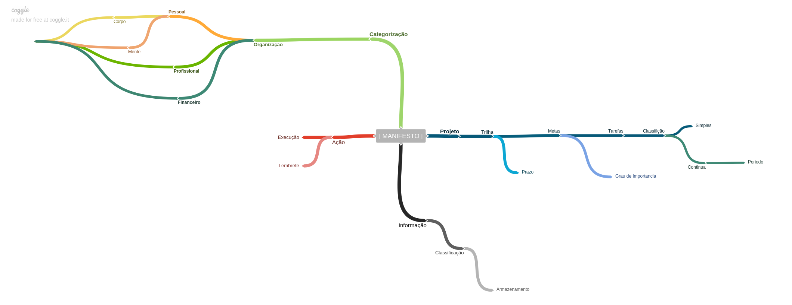
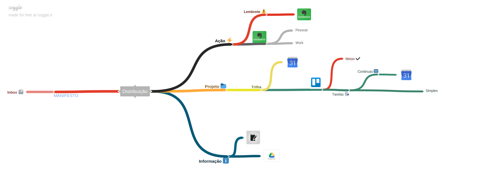

# Absolutus-zero
---

## _Introdução_
`` Através de  UM MANIFESTO toda  e qualquer informação é avaliada, classificada e distribuida dentro de um fluxo onde 
dependendo do tipo de dado informado ela é direcionada para um grupo correspondente ao seu perfil, facilitando assim o controle e o aproveitamento de todas as ações que precisam ser tomadas com base na informação passada. ``

---

# PROCESSO

A informação é avaliada com base no MANIFESTO DE CLASSIFICAÇÃO, depois é direcionada dentro do fluxo e movida a um grupo, com base em sua classificação.

# Grupos
 > ##  Projeto
 Um projeto é um processo que demanda mais tempo e possui sempre ao menos uma trilha, ele não possui um prazo e só pode ser considerado como concluido quando todas as suas trilhas forem finalizadas com sucesso.  
 **Um exemplo de PROJETO é**  _Aprender um segundo idioma_

> ## Informação
Todo conteudo que é considerado como sendo util e que NÃO esteja relacionado de forma direta a uma tarefa é considerado uma informação.  
**Um exemplo de INFORMAÇÃO é** _Um artigo sobre processos economicos_

> ## Ação
Toda tarefa que possa ser realizada em um tempo inferior a **10 minutos**. Tarefas que dependem de terceiros são classificadas como LEMBRETES
**Um exemplo de AÇÃO é** _Pagar uma conta no caixa_

## SubGrupos
> ## Trilha
É um conjunto de METAS com um prazo final para que todas sejam concluidas, é considerada como concluida com sucesso quando todas as suas METAS são finalizadas dentro do prazo.  
**Um exemplo de TRILHA é** _Playlist sobre DDD_
> ## Meta
 É o objetivo de duas ou mais tarefas, sendo que uma meta só esta concluida quando todas as suas TAREFAS forem concluidas,
 Uma meta possui um grau de importancia que determina o quanto esta deve ser priorizada em comparação as outras da mesma TRILHA.  
 **Um exemplo de META é** _Chegar a 30% no Duolingo_

> ## Tarefa
É uma ação que deve ser classificada com base em sua DURAÇÃO, desse modo pode-se determinar se ela é:
 - Continua: A mesma tarefa sendo repetida diariamente dentro de um determinado periodo que pode ou não ter um termino previsto
 - Simples: Um tarefa que pode ser executada dentro de 24 horas, sem dependencias de terceiros  

**Um exemplo de TAREFA é** _Assistir a aula de C# no [Pluralsight]( pluralsight.com)_

---

## Fluxo de Categorização

---
## Fluxo de Distribuição

## Documentos Importantes
- [MODELO DO FLUXO DE INFORMAÇÕES](https://coggle.it/diagram/Wc0tvUyLwQABrKsl)  
- [MODELO DO FLUXO DE DISTRUIÇÃO](https://coggle.it/diagram/Wc55LSY9AQABlewQ)
- MANIFESTO DE CLASSIFICAÇÃO

## Projeto PWA [_Em Progresso_]

 O objetivo é criar um Dashboard com todas as informações sobre os projetos com integração ao Trello e o Google Calendar

